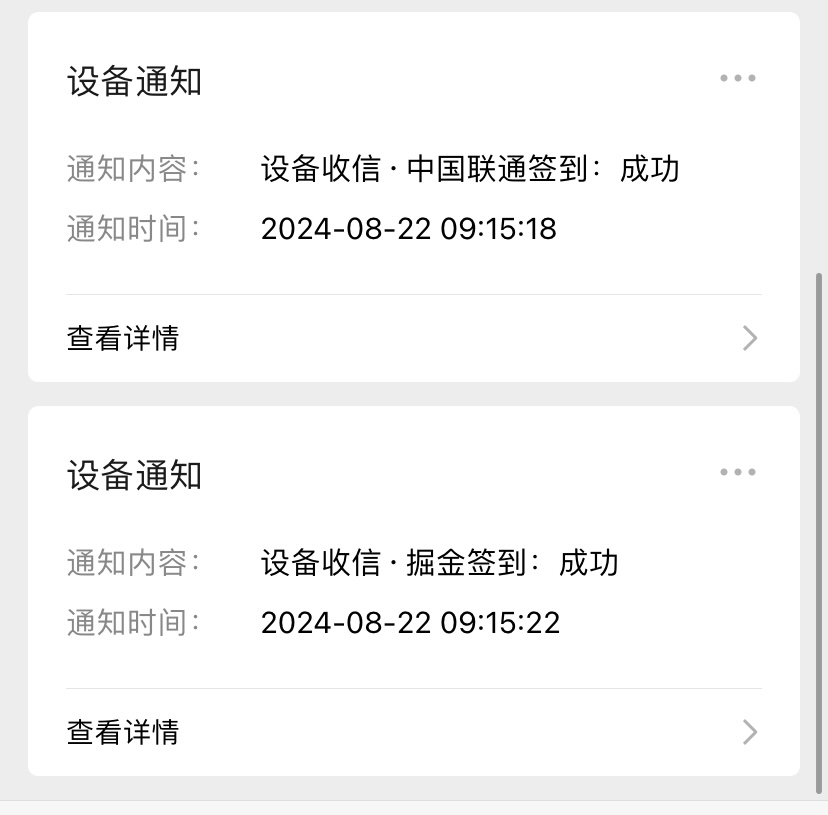
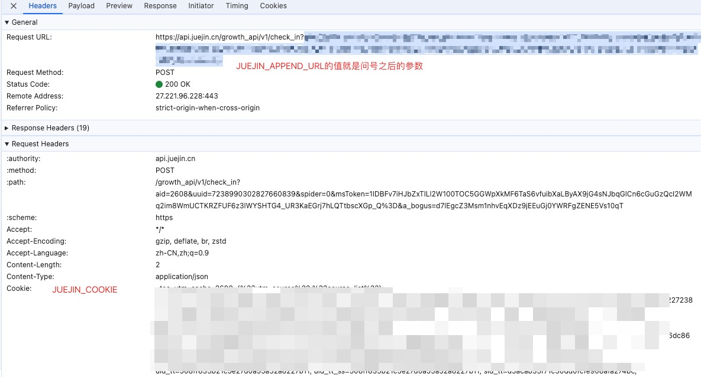

# node-signin



## 介绍
* node-signin是一个执行日常签到任务的脚本，该项目仅用于学习和交流。
* 消息推送方案采用Server酱。

#### 目前主要功能

* 稀土掘金
    * 每日自动签到
    * 每日自动抽奖

* 中国联通
    * 每日自动签到

# 使用

将项目fork到自己的仓库。本项目使用环境变量来管理敏感信息和配置。为了方便本地开发，我们使用 `.env.local` 文件来存储这些变量。

## 安装项目依赖

在根目录运行以下命令

```
pnpm install
```

## 运行项目

本地运行
```
pnpm run start:local
```

## 环境变量

### 1. 设置 `.env.local` 文件

在你第一次克隆项目并准备启动时，请执行以下步骤：

运行以下命令来自动生成 `.env.local` 文件：

```bash
pnpm run setup
```

### 2. 设置环境变量

- 本地运行的话，修改根目录下的.env.local文件
- 使用github actions可以实现定时任务，每天自动触发。在项目Settings => Secrets and variables => Actions下配置secrets即可。

| 环境变量名称 | 备注 |
| --- | --- |
| CHINA_UNICOM_SIGNIN_COOKIE | 中国联通签到的cookie |
| JUEJIN_APPEND_URL | 稀土掘金附加url，用于签到和抽奖 |
| JUEJIN_COOKIE | 稀土掘金的cookie |
| SERVERCHAN_KEY | server酱的key |

# 参数抓包截图

#### 掘金



# 相关工具

* 手机抓包工具
    * Stream

* Server酱
    * 「Server酱」，英文名「ServerChan」，它可以将服务器（或其他应用程序）产生的消息通过微信公众号推送给个人微信账号，实现消息的实时推送功能。
    * https://sct.ftqq.com/r/13293
