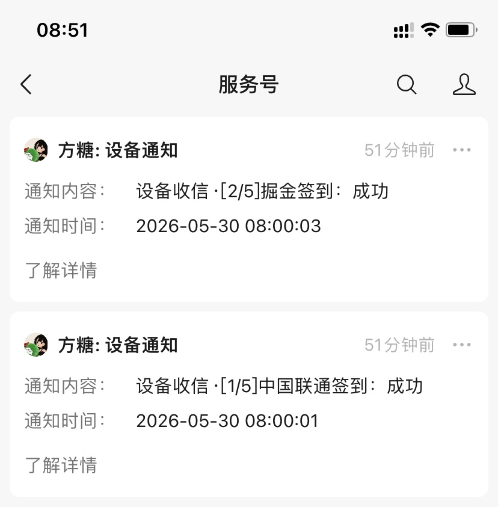
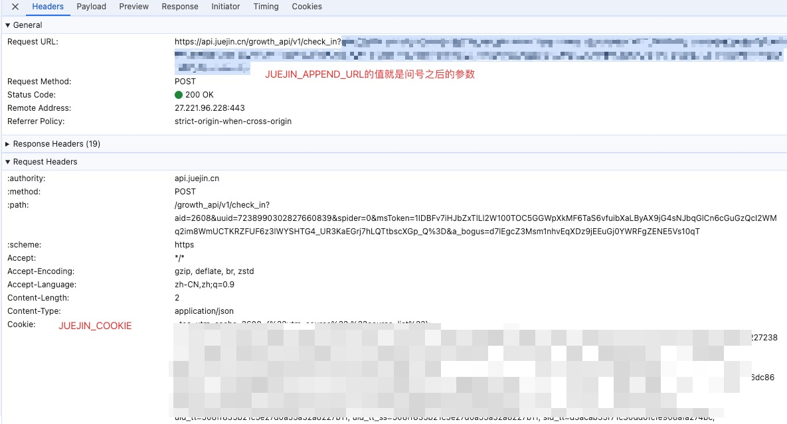

# node-signin



## 介绍
* node-signin是一个执行日常签到任务的脚本，该项目仅用于学习和交流。
* 消息推送方案采用Server酱。

#### 目前主要功能

* 稀土掘金
    * 每日自动签到
    * 每日自动抽奖

* 中国联通
    * 每日自动签到

# 使用

本项目支持三种运行方式：

## 方式一：Docker 部署（推荐）

使用 Docker 镜像快速部署，支持定时任务自动执行。

### 本地部署

先构建镜像：

```bash
docker build -t node-signin:latest .
```

然后运行镜像：

```bash
docker run -d \
  --name node-signin \
  --restart unless-stopped \
  -e CHINA_UNICOM_SIGNIN_COOKIE="你的联通Cookie" \
  -e JUEJIN_APPEND_URL="你的掘金URL" \
  -e JUEJIN_COOKIE="你的掘金Cookie" \
  -e SERVERCHAN_KEY="你的Server酱Key" \
  -e TZ=Asia/Shanghai \
  node-signin:latest
```

### 或者直接使用本项目的镜像直接运行

```bash
docker run -d \
  --name node-signin \
  --restart unless-stopped \
  -e CHINA_UNICOM_SIGNIN_COOKIE="你的联通Cookie" \
  -e JUEJIN_APPEND_URL="你的掘金URL" \
  -e JUEJIN_COOKIE="你的掘金Cookie" \
  -e SERVERCHAN_KEY="你的Server酱Key" \
  -e TZ=Asia/Shanghai \
  registry.cn-hangzhou.aliyuncs.com/ityadong/node-signin:latest
```

### 本地使用 Docker Compose部署

创建 `docker-compose.yml` 文件：

```yaml
version: '3.8'

services:
  app:
    # 使用当前目录的 Dockerfile 构建镜像
    build: .
    container_name: node-signin
    restart: unless-stopped
    environment:
      - CHINA_UNICOM_SIGNIN_COOKIE=你的联通Cookie
      - JUEJIN_APPEND_URL=你的掘金URL
      - JUEJIN_COOKIE=你的掘金Cookie
      - SERVERCHAN_KEY=你的Server酱Key
      - TZ=Asia/Shanghai
    volumes:
      - ./logs:/var/log
```

启动容器：

```bash
docker compose up -d --build
```

### 查看日志

```bash
# 查看容器日志
docker logs -f node-signin

# 查看 cron 定时任务日志
docker exec node-signin cat /var/log/cron.log
```

### 定时任务说明

容器内已配置 cron 定时任务，默认每天早上 8:00 自动执行签到。

## HTTP 日志与排查

为方便排查签到失败（例如 Server酱 收到 `err_no=xxxx`、或提示「签到失败了~」），项目会把每次签到的 HTTP 请求与响应**始终记录**到日志文件，无需任何开关。

### 日志位置

- 文件名：`http.log`（位于 `LOG_DIR`，默认 `./logs`；Docker 中为 `/var/log`，已挂载到宿主机 `./logs`）
- 记录内容：请求方法、URL、**脱敏后的 cookie**（只显示长度和首尾几位，不输出明文）、请求体，以及响应状态码和完整响应体（含掘金返回的 `err_no`、`err_msg`）

查看最近日志：

```bash
# 宿主机直接看（日志已挂载出来）
tail -n 50 logs/http.log

# 或进容器看
docker exec node-signin tail -n 50 /var/log/http.log
```

### 日志轮转

为避免日志无限增长，文件超过 `LOG_MAX_SIZE`（默认 5MB）时自动轮转：`http.log → http.log.1 → http.log.2 → ...`，最多保留 `LOG_MAX_FILES` 份（默认 3 份），最老的自动删除。最坏占用约 `LOG_MAX_SIZE ×(LOG_MAX_FILES + 1)` 封顶（默认约 20MB）。

### DEBUG_HTTP 开关

`DEBUG_HTTP` **只控制是否额外把日志打印到控制台**，不影响文件记录。临时在前台看实时输出时可用，例如不影响生产 cron、单独跑一次掘金脚本：

```bash
docker exec -e DEBUG_HTTP=true node-signin node /app/scripts/juejin/index.js
```

### 使用 Portainer 部署（推荐用于生产环境）

如果你使用 Portainer 管理 Docker 容器，可以通过 Stack 方式部署：

1. 登录 Portainer 管理界面
2. 进入 `Stacks` 页面
3. 点击 `Add stack` 创建新的 Stack
4. 输入以下配置：

```yaml
version: '3.8'

services:
  app:
    image: registry.cn-hangzhou.aliyuncs.com/ityadong/node-signin:latest
    # 每次启动时拉取最新镜像
    pull_policy: always
    container_name: node-signin
    restart: unless-stopped
    environment:
      - CHINA_UNICOM_SIGNIN_COOKIE=${CHINA_UNICOM_SIGNIN_COOKIE}
      - JUEJIN_APPEND_URL=${JUEJIN_APPEND_URL}
      - JUEJIN_COOKIE=${JUEJIN_COOKIE}
      - SERVERCHAN_KEY=${SERVERCHAN_KEY}
      - TZ=Asia/Shanghai
    volumes:
      - ./logs:/var/log
```

5. 在 `Environment variables` 区域配置环境变量
6. 点击 `Deploy the stack`

#### 配置 Webhook 自动更新

为了实现 GitHub Actions 自动部署，需要配置 Portainer Webhook：

1. 在 Stack 详情页面，找到 `Webhooks` 选项
2. 点击 `Add webhook`
3. 复制生成的 Webhook URL
4. 在 GitHub 仓库的 `Settings` → `Secrets and variables` → `Actions` 中添加：
   - `PORTAINER_WEBHOOK_URL`: 刚才复制的 Webhook URL

## 方式二：本地开发

将项目fork到自己的仓库。本项目使用环境变量来管理敏感信息和配置。为了方便本地开发，我们使用 `.env.local` 文件来存储这些变量。

### 安装项目依赖

在根目录运行以下命令

```
pnpm install
```

### 运行项目

本地运行
```
pnpm run start:local
```

## 方式三：GitHub Actions 手动运行

适合临时测试或手动触发签到任务。

1. 进入 GitHub 仓库页面
2. 点击 `Actions` 标签
3. 选择 `daily-node-task` 工作流
4. 点击 `Run workflow` 按钮
5. 选择分支后点击 `Run workflow` 执行

**注意**：GitHub Actions 服务器在国外，访问国内服务可能不稳定，建议使用 Docker 部署方式。

## 环境变量

### 1. 设置 `.env.local` 文件

在你第一次克隆项目并准备启动时，请执行以下步骤：

运行以下命令来自动生成 `.env.local` 文件：

```bash
pnpm run setup
```

### 2. 设置环境变量

- 本地运行的话，修改根目录下的.env.local文件
- 使用github actions可以实现定时任务，每天自动触发。在项目Settings => Secrets and variables => Actions下配置secrets即可。

| 环境变量名称 | 备注 |
| --- | --- |
| CHINA_UNICOM_SIGNIN_COOKIE | 中国联通签到的cookie |
| JUEJIN_APPEND_URL | 稀土掘金附加url，用于签到和抽奖 |
| JUEJIN_COOKIE | 稀土掘金的cookie |
| SERVERCHAN_KEY | server酱的key |
| DEBUG_HTTP | 可选。设为 `true`/`1` 时，HTTP 请求/响应额外打印到控制台（不影响日志文件，详见「HTTP 日志与排查」） |
| LOG_DIR | 可选。日志目录，默认 `./logs`（Docker 中为 `/var/log`，已挂载到宿主机 `./logs`） |
| LOG_MAX_SIZE | 可选。单个日志文件大小上限（字节），默认 `5242880`（5MB），超过即轮转 |
| LOG_MAX_FILES | 可选。保留的历史日志份数，默认 `3`（`http.log.1` ~ `http.log.3`） |

# 参数抓包截图

#### 掘金



# 相关工具

* 手机抓包工具
    * Stream

* Server酱
    * 「Server酱」，英文名「ServerChan」，它可以将服务器（或其他应用程序）产生的消息通过微信公众号推送给个人微信账号，实现消息的实时推送功能。
    * https://sct.ftqq.com/r/13293
